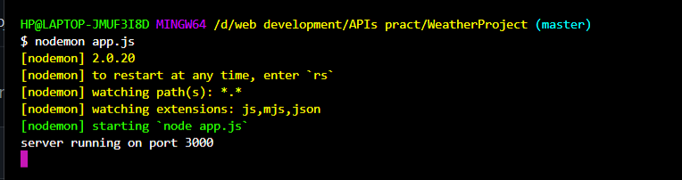
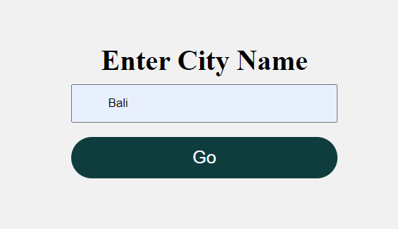
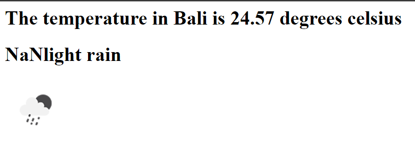

# Weather-App 🌦️

## A Simple web-app where live weather conditions shown through the use of API.  
 
 
Localhost server :  

 
 
https status code 200 describes 'Successful responses --> OK'  
 

 
On http://localhost:3000/ :  

  
 

 
Rendered result by Openweather API :  

